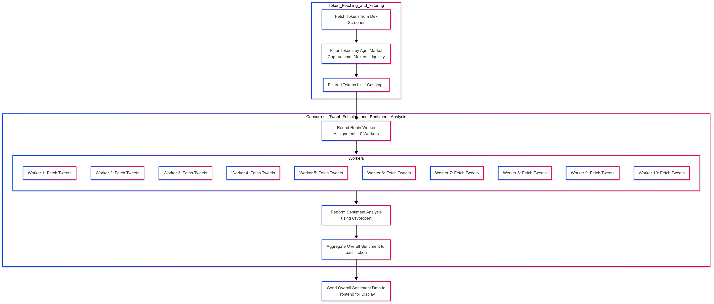

# Word Of Mouth AI (WOM)

[](https://www.python.org/)
[](LICENSE)

---

## Overview

**Word Of Mouth AI (WOM)** is a modular and scalable AI designed to assess the market sentiment of newly listed cryptocurrency tokens using real-time Twitter data. It combines data ingestion, parallel tweet fetching, transformer-based sentiment analysis, and frontend delivery.

---

## Token Fetching & Filtering

Tokens are fetched from **Dex Screener**, which provides real-time listings of newly created liquidity pools across decentralized exchanges.

To ensure quality and avoid spam tokens, the following **filters** are applied:

| Filter Criteria      | Description                                                           |
|----------------------|-----------------------------------------------------------------------|
| Age                  | Only tokens created within the last 48 hours are considered           |
| Market Cap           | Super Low Market Caps excluded                                        |
| Volume               | Filters out tokens with extremely low or suspicious volume            |
| Liquidity            | Ensures that the token has some level of real liquidity               |
| Maker Count          | Tokens with too few or suspicious makers are excluded                 |
| Uniqueness / Validity| Duplicates, honeypots, or malformed data entries are skipped          |

After this stage, a **filtered list of cashtags** is used as input to the tweet scraping pipeline.

---

## Concurrent Tweet Fetching with Round-Robin Assignment

- Tweets are fetched via **10 Apify workers** concurrently.
- A [**round-robin scheduler**](https://en.wikipedia.org/wiki/Round-robin_scheduling) assigns each token to a task in a rotating fashion.
- This ensures efficient distribution and concurrency without overloading any single worker.

### Round-Robin Assignment Example

- 10 workers, 25 tokens
- Token 1 → Worker 1  
  Token 2 → Worker 2  
  …  
  Token 10 → Worker 10  
  Token 11 → Worker 1 again, and so on.

---

## Tweet Filtering

Before sentiment analysis, collected tweets are pre-filtered to improve quality and reduce noise:

| Filter                            | Purpose                                             |
|-----------------------------------|-----------------------------------------------------|
| Language: English only            | Keeps model output consistent and accurate          |
| Minimum length: > 3 words         | Removes noise, low-effort spam, or just emojis      |
| Hashtag and emoji limits          | Excludes overly promotional or shill tweets         |
| Minimum user followers            | Filters out posts from bot or inactive accounts     |

---

## Sentiment Analysis using CryptoBERT

### What is Sentiment Analysis?

Sentiment analysis is the NLP task of classifying a text’s emotional tone. In this case, we evaluate how optimistic or pessimistic a tweet is about a specific token.

### CryptoBERT Overview

- A transformer-based model fine-tuned on **3.2 million crypto-related tweets**
- Able to interpret slang, sarcasm, and crypto-native terminology
- Outputs class logits → softmax probabilities → sentiment scores

### Processing Pipeline

1. **Preprocessing** – Cleaning text, removing unwanted characters
2. **Tokenization** – Preparing the tweet for model input
3. **Model Inference** – Generating sentiment scores
4. **Bullishness Extraction** – Extracting the positive class probability
5. **Aggregation** – Average of all tweet scores per token → final score (%)

---

## Result Dispatch

Once all tokens are processed:

- Sentiment data is stored in SQLite
- An API layer exposes endpoints to the frontend
- The frontend visualizes this data in real time

---

## Pipeline Diagram



*The diagram above illustrates the full data flow, including token filtering, round-robin tweet retrieval, sentiment analysis, and frontend API delivery.*

---

## API Endpoints

| Method | Route                            | Description                                |
|--------|----------------------------------|--------------------------------------------|
| GET    | `/tokens`                        | Retrieve all token sentiment summaries     |
| GET    | `/tweets/{token_symbol}`         | Run live sentiment for a single token      |
| GET    | `/stored-tweets/?token=XYZ`      | Retrieve stored tweet sentiment snapshots  |
| GET    | `/tweet-volume/?token=XYZ`       | Get tweet count in last 6 hours            |
| GET    | `/search-token/{chain}/{address}`| Lookup token via Dex Screener API          |
| GET    | `/run-scheduled-job`             | Trigger pipeline execution                 |

---

## Frontend Integration

This project integrates with a frontend dashboard available here:  
[**Frontend Repo: wom-fe**](https://github.com/cruellacodes/wom-fe)

The frontend includes:

- Radar chart for 6-hour tweet volume comparison
- Podium-style ranking for top tokens by tweet count
- Bar chart for top tokens by WOM Score
- CA Search Bar 
- Twitter Scatter Chart that displays tweets by token in the last 24h
- Info Token Card
- Leaderboard
- Bubble Chart that displays tweets from Leaderboard tokens in the last 24h

The data is fetched directly from the backend API.

---

## Setup and Installation

### Prerequisites

- Python 3.7+
- Environment variables:
  - `APIFY_API_TOKEN`
  - `TOKEN_ACTORS` (comma-separated list of 10 Apify tasks)
  - `COOKIES` (optional)

### Installation Steps

```bash
git clone https://github.com/cruellacodes/wom.git
cd crypto-sentiment-analyzer
python -m venv venv
source venv/bin/activate  # On Windows: venv\Scripts\activate
pip install -r requirements.txt
